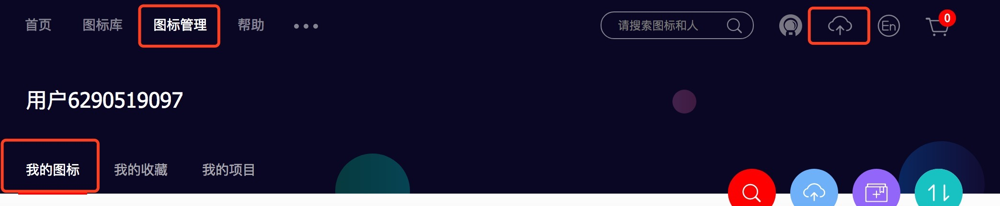
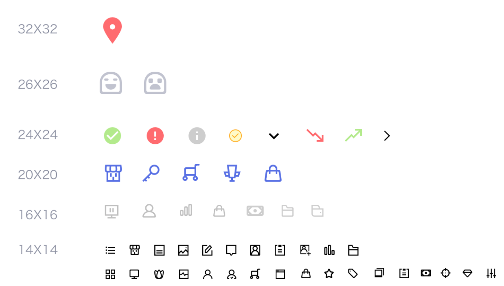
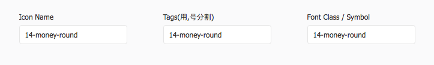
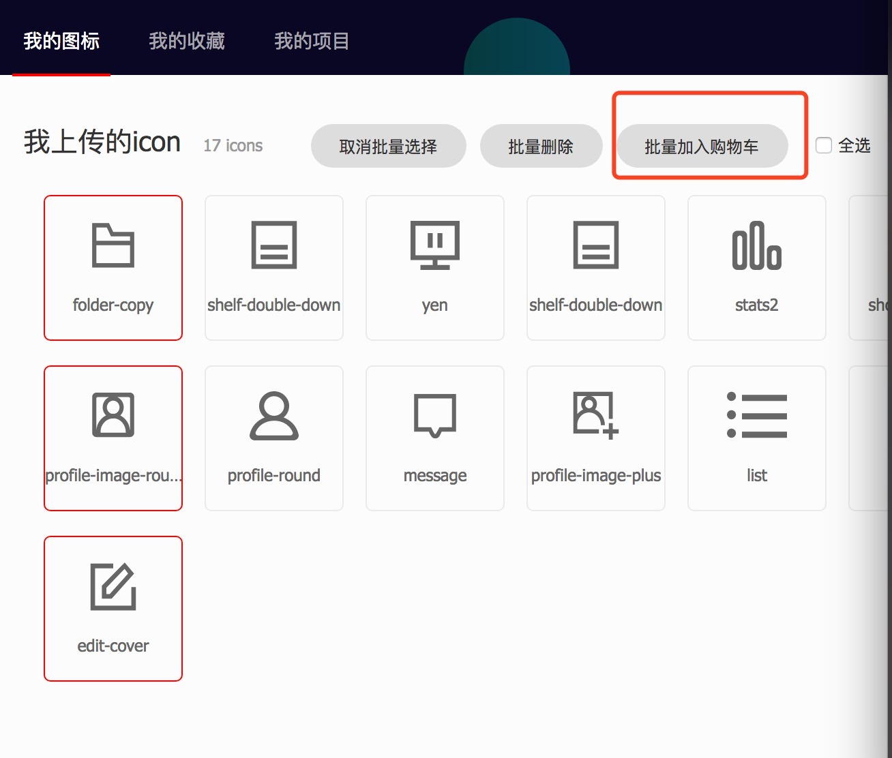
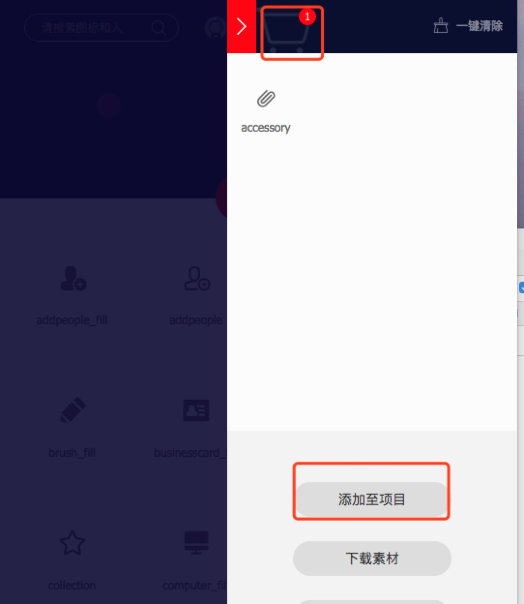
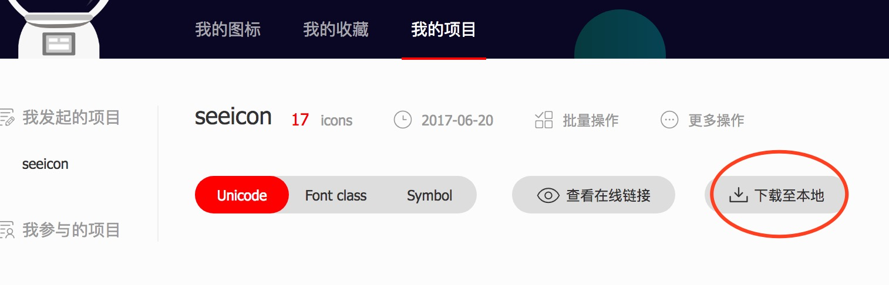

字体图标管理
====

## 流程

1. 导出 svg
2. 上传到 iconfont
3. 下载导出
4. 将导出文件覆盖 src/fonts/sicon
5. 提交

## iconfont 操作

### 帐号

seeseedesign@163.com/iseeu2016

### 步骤

1. 上传到「我的图标」



2. 统一命名

设计规范了各种尺寸的 icon，


避免混用，class 命名规则：


最终调用
```html
<i class="si si-14-money-round"></i>
```

3. 添加图标到「购物车」



4. 购物车导入「我的项目」



5. 去到「我的项目」下载




