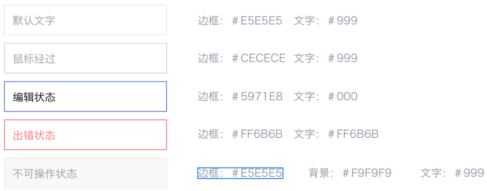
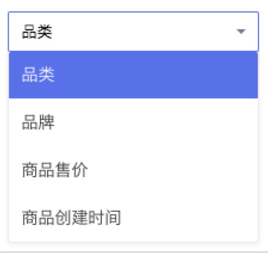
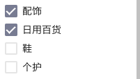
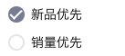
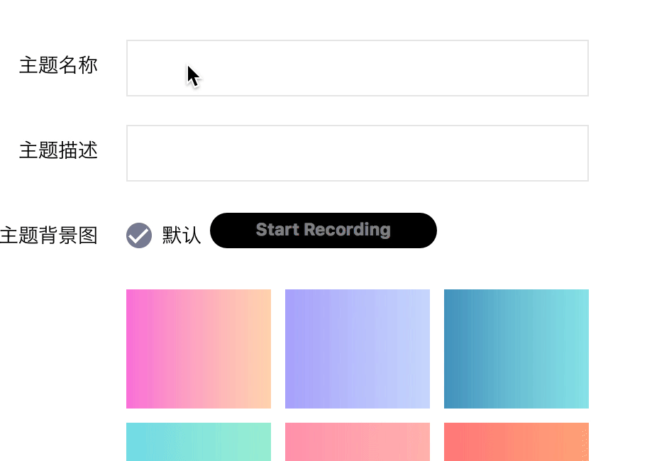
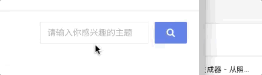

后台 UI 规范
===

现有的 UI 采用 [Ant Design](https://ant.design/docs/spec/introduce-cn) 设计规范，品牌色为 `#5971e8`。

新的 UI 公共样式编写在 [src/app/styles.less](./src/app/styles.less) 文件内。

# Deprecated!

1. 建议尽量不要直接改动 `styles/theme/**`，而是通过样式覆盖的方式，
方便其他人快速查看有哪些覆盖改动

2. 对于字体覆盖，则通过脚本 `styles/overrideThemeFont.js` 生成
 `font-override-auto-gen-dont-edit.less`，一般无须再覆盖模板主题样式的字体，
 如果发现有还有未覆(bu)盖(ke)到(neng)的，则修改脚本

3. 逐步对 zeplin 中「后台UI规范」抽象出相关变量到 `styles/var.less` 中，形如

   ``` les
   //////////////////////////////////////////
   // 小电铺后台 UI 规范 --- 输入框：颜色样式
   //////////////////////////////////////////
   @see-input-color: #999;
   @see-input-border-color: #e5e5e5;
   @see-input-hover-color: #999;
   ...
   ```

> 依据 zeplin 的 UI 规范，在兼容目前代码情况的基础上尽量统一 UI

## 输入框

### 颜色样式



```html
<input type="text" class="see-input-text">
```

### 输入 mask


```html
<input input-mask="POSITIVE_INTEGER" class="see-input-text">
```
这里表示使用内置的规则，让输入框只能输入正整数，需要添加规则的话，可以在 `input-mask.directive.ts` 修改:

```js
const DEFAULT_TESTERS = {
  POSITIVE_INTEGER: (val) => /^[1-9][0-9]*$/.test(val)
  // 更多规则加在这里
};
```

除了用内置规则，还可以直接输入配置正则：

```html
 <input input-mask="\d+"> 表示只允许输入数字

```


## 表单下拉选项




```
<see-select
required
options="$ctrl.ruleOptions"
name="rule"
ng-model="$ctrl.formData.rule"></see-select>

其中
$ctrl.ruleOptions = [{id: 1, name: '第一选项'},...]
```


`see-select` 内部使用 `ui-select`（所有属性直接 copy 过去） ，可以把 `<see-select>` 当做 `<ui-select>`

注意：`ui-select` 的选中值(ng-model) 是一个对象 item，这里保持一致

## 复选框

### 单个 checkbox

```html
 <see-checkbox name="groupName">记住密码</see-checkbox>
```

### 多个 checkbox



```html
<see-mul-check items="items" ng-model="$ctrl.choices"></see-mul-check>
```

```js
items = [
	{val: 'a', text: '选项 A'},
	{val: 'b', text: '选择 B},
	...
]
```

ngModel 的值就是选中项的 `val` 用  `,` 连接，例如 `"a,b"`

### radio 选项



```html
<see-radio-group
items="items"
ng-model="vm.gender"
name="xx"
 ></see-radio-group>
```


其中 items 的格式跟 <see-mul-check> 一样。当然，你可以手写多个 radio

```
<see-checkbox type="radio" value="male" name="gender" ng-model="gender">男</see-checkbox>
<see-checkbox type="radio"  value="female" name="gender" ng-model="gender">女</see-checkbox>
```

### textarea-autosize 指令

自动调整文本框大小



```
<textarea textarea-autosize
         placeholder="请输入对应石墨链接"
         class="see-input-text"
         row="1"
></textarea>
```


### input-clear 指令

清空文本框



```html
不触发提交事件
<input type="text" input-clear>
```

```
触发最近表单的 submit 事件
<input type="text" input-clear="submit">
```
